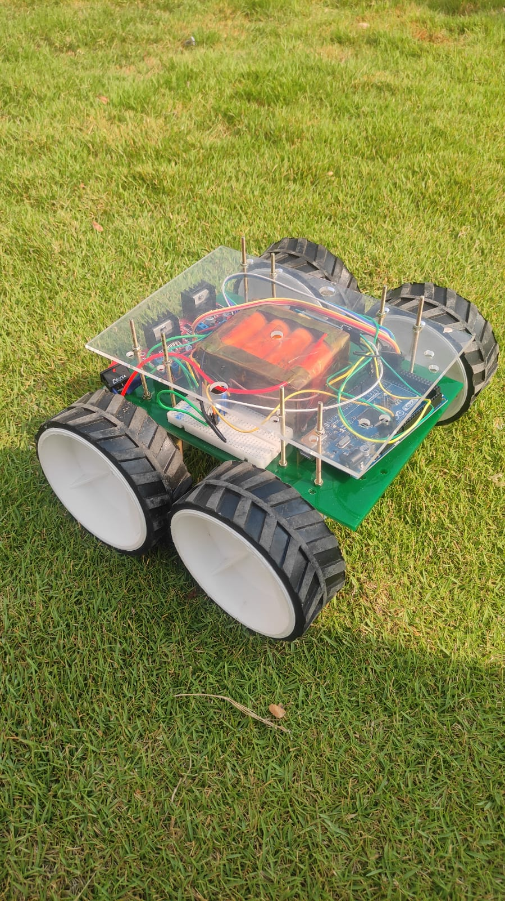
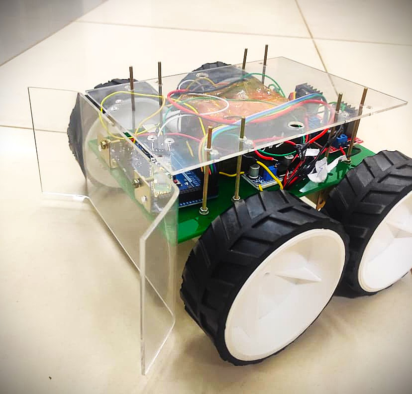

# RoboEdge - Bluetooth Controlled Robot

##  Project Overview

This project is a 4-wheel Bluetooth-controlled robotic vehicle developed for the **RoboEdge Inter-College Competition**.

The robot uses an **Arduino Mega 2560** as the main controller and an **HC-05 Bluetooth module** for wireless communication. Two motor drivers are used to control four DC geared motors, allowing the robot to move forward, backward, left, right, and stop based on commands received from a mobile phone.

##  Objective

To design and develop a compact, manually controlled robotic vehicle capable of wireless movement and direction control using Bluetooth communication.

##  Hardware Components

- Arduino Mega 2560
- HC-05 Bluetooth Module
- 4 × DC Geared Motors
- 2 × L298N Motor Drivers
- 4S2P Li-ion Battery Pack
- Buck Converter
- Robot Chassis
- 4 Wheels

##  Software

- Arduino IDE
- Arduino C/C++
- Bluetooth Serial Communication

## 🔌 Pin Connections

### Left Motor Driver

| Arduino Mega Pin | Function |
|---|---|
| 22 | IN1 |
| 23 | IN2 |
| 24 | IN3 |
| 25 | IN4 |

### Right Motor Driver

| Arduino Mega Pin | Function |
|---|---|
| 26 | IN5 |
| 27 | IN6 |
| 28 | IN7 |
| 29 | IN8 |

The HC-05 Bluetooth module communicates with the Arduino Mega through `Serial1`.

##  Working Principle

The mobile phone sends movement commands to the **HC-05 Bluetooth module**.

The Arduino Mega receives these commands through `Serial1` and controls the two motor drivers accordingly.

| Command | Movement |
|---|---|
| `F` | Forward |
| `B` | Backward |
| `L` | Left |
| `R` | Right |
| Other / Default | Stop |

### Movement Control

- **Forward:** All four motors rotate in the forward direction.
- **Backward:** All four motors rotate in the reverse direction.
- **Left:** Left-side motors rotate backward while right-side motors rotate forward.
- **Right:** Left-side motors rotate forward while right-side motors rotate backward.
- **Stop:** All motor control pins are set LOW.

##  Features

- Wireless Bluetooth control
- 4-wheel drive
- Forward and backward movement
- Left and right turning
- Mobile-based control
- Arduino-based motor control
- Compact robotic platform

##  Competition

This robot was developed for the **RoboEdge Inter-College Competition**, which consisted of three rounds:

1. **Robo Soccer** – Robot-based soccer challenge.
2. **Robo Race** – Manual robot racing challenge.
3. **Robo Obstacle** – Robot navigation through an obstacle course.

The Bluetooth-controlled robot was designed as a manually controlled platform for these competition challenges.

##  Robot Images

### Front View

### Side View

##  Repository Contents

- `Robo_arduino_code.ino` – Arduino code for Bluetooth communication and motor control.

##  Future Improvements

- Add obstacle detection sensors
- Implement autonomous navigation
- Add speed control using PWM
- Add camera-based object detection
- Improve robot chassis and power management
